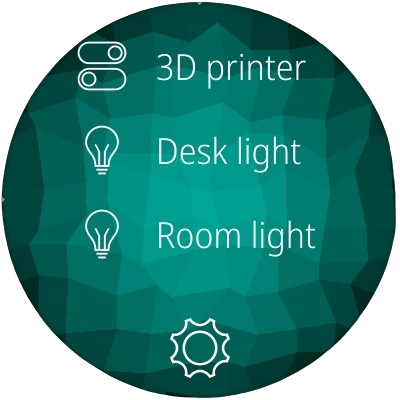

# AsteroidOS Home Assistant
A Home Assistant app for [AsteroidOS](http://asteroidos.org/)



## Configuration

A config file is generated upon first launch it will be located at `/home/ceres/.config/asteroid-hass.conf`.
Adjust the Home Assistant host and token to use your host.

A long-lived access token needs to be generated, this can be done by navigating to your Home Assistant user profile and clicking "Create token".

Once complete the config file should look something like:
```
[General]
HASS_HOST=http://homeasssistanthost
HASS_TOKEN=PaUpJVXpJMU5pSXNJblI1Y0NJNklrcFhWQ0o5LmV5SnBjM01pT2lJMVpEWmhaREUzT0RreU1HUTBZamd5T1RFM01UWmhNMkZoTmpnNU9EVmxaU0lzSW1saGRDSTZNVGN5TkRVeU56QTJPU3dpWlh_od0lqb3lNRE01T.0RnM01EWTVmUS5BMURz
```

Upon first launch all entities will be fetched, and you'll be prompted to select which entities to show on the main screen.